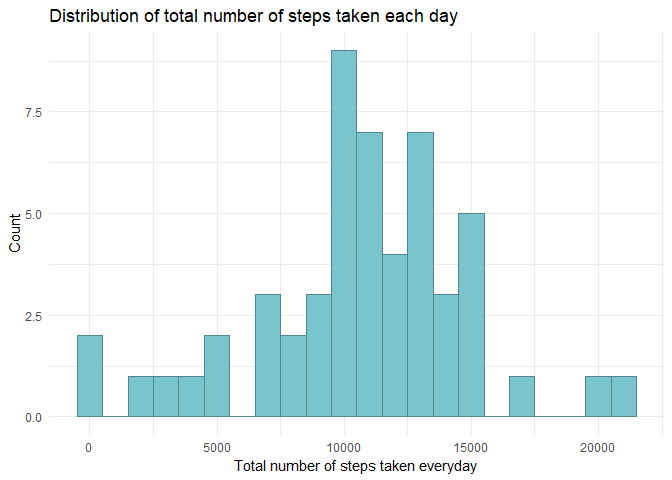
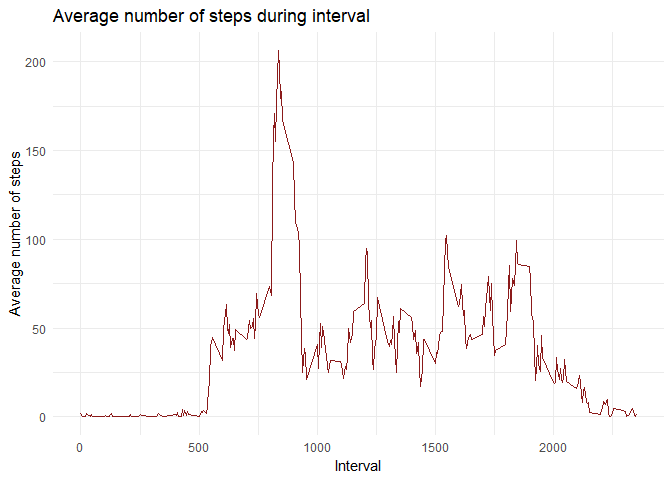
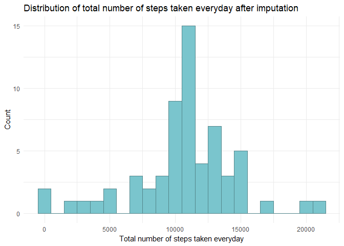
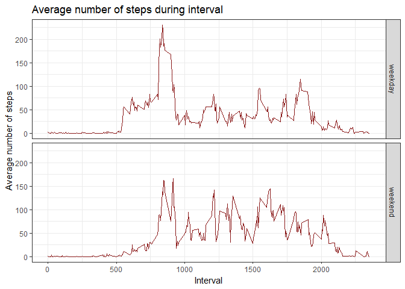

## Loading and preprocessing the data


``` r
activity <- read.csv(unz("activity.zip", "activity.csv"))
```

## What is mean total number of steps taken per day?


``` r
activity %>%
    group_by(
        date
    ) %>%
    summarise(
        total = sum(steps)
    ) -> daily_activity

head(daily_activity)
```

```
## # A tibble: 6 × 2
##   date       total
##   <chr>      <int>
## 1 2012-10-01    NA
## 2 2012-10-02   126
## 3 2012-10-03 11352
## 4 2012-10-04 12116
## 5 2012-10-05 13294
## 6 2012-10-06 15420
```


``` r
ggplot(daily_activity, aes(total)) + 
    geom_histogram(binwidth = 1000, color = "cadetblue4", fill = "cadetblue3") + 
    labs(x = "Total number of steps taken everyday", y = "Count",
         title = "Distribution of total number of steps taken each day") +
    theme_minimal()
```

```
## Warning: Removed 8 rows containing non-finite outside the scale range (`stat_bin()`).
```

<!-- -->


``` r
mean_daily_steps <- mean(daily_activity$total, na.rm = TRUE)
median_daily_steps <- median(daily_activity$total, na.rm = TRUE)
```

The average number of steps taken per day is 10766.19, while the median is 10765.00.

## What is the average daily activity pattern?


``` r
activity %>%
    group_by(
        interval
        ) %>%
    summarise(
        mean_steps = mean(steps, na.rm = TRUE)
    ) -> interval_activity
```


``` r
ggplot(interval_activity, aes(x = interval, y = mean_steps)) + 
    geom_line(color = "firebrick4") +
    labs(x = "Interval", y = "Average number of steps", 
         title = "Average number of steps during interval") +
    theme_minimal()
```

<!-- -->


``` r
max_steps_interval <- interval_activity[which.max(interval_activity$mean_steps),]$interval
```

On average, the highest number of steps was recorded during the interval numbered 835.

## Imputing missing values


``` r
na_count <- sum(is.na(activity))
```

The total number of missing values is 2304.

Based on the analyses conducted in the previous steps, the most reasonable approach is to impute the missing values using the average number of steps for the corresponding interval.


``` r
activity %>%
  left_join(interval_activity, by = "interval") %>%
  mutate(steps = ifelse(is.na(steps), mean_steps, steps)) %>%
  select(-mean_steps) -> activity_imputed
```


``` r
activity_imputed %>%
    group_by(
        date
    ) %>%
    summarise(
        total = sum(steps)
    ) -> imputed_daily_activity

head(imputed_daily_activity)
```

```
## # A tibble: 6 × 2
##   date        total
##   <chr>       <dbl>
## 1 2012-10-01 10766.
## 2 2012-10-02   126 
## 3 2012-10-03 11352 
## 4 2012-10-04 12116 
## 5 2012-10-05 13294 
## 6 2012-10-06 15420
```


``` r
ggplot(imputed_daily_activity, aes(total)) + 
    geom_histogram(binwidth = 1000, color = "cadetblue4", fill = "cadetblue3") + 
    labs(x = "Total number of steps taken everyday", y = "Count",
         title = "Distribution of total number of steps taken everyday after imputation") +
    theme_minimal()
```

<!-- -->


``` r
mean_daily_steps_imputed <- mean(imputed_daily_activity$total, na.rm = TRUE)
median_daily_steps_imputed <- median(imputed_daily_activity$total, na.rm = TRUE)
```

After data imputation, the mean is 10766.19 and the median is 10766.19.

## Are there differences in activity patterns between weekdays and weekends?


``` r
activity_imputed %>%
    mutate(
        date = as.Date(date),
        weekday = weekdays(date),
        day_type = factor(ifelse(weekday %in% c("Saturday", "Sunday"),
                             "weekend", "weekday"))
    ) -> activity_imputed_weekdays
```


``` r
activity_imputed_weekdays %>%
    group_by(
        day_type,
        interval
        ) %>%
    summarise(
        mean_steps = mean(steps, na.rm = TRUE),
        .groups = "drop"
    ) -> interval_activity_imputed_weekdays
```


``` r
ggplot(interval_activity_imputed_weekdays, aes(x = interval, y = mean_steps)) + 
    geom_line(color = "firebrick4") +
    facet_grid(day_type ~.) +
    labs(x = "Interval", y = "Average number of steps", 
         title = "Average number of steps during interval") +
    theme_bw()
```

<!-- -->


